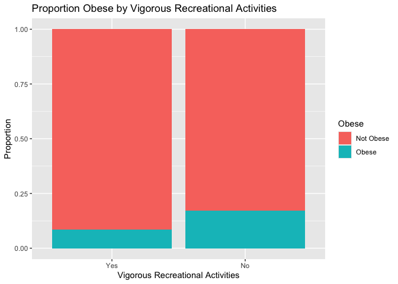
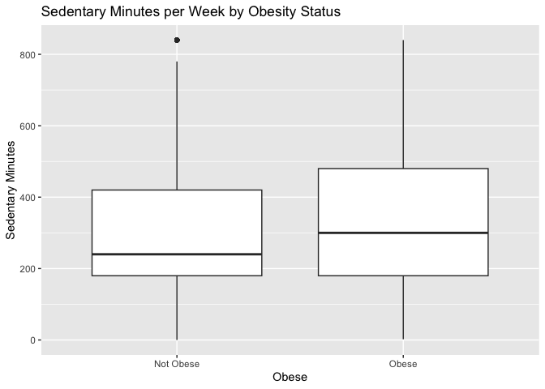

Does Physical Activity Reduce the Likelihood of Obesity?
================

## Introduction

In this analysis, I use data from the NHANES dataset in the aplore3 R
package to explore whether physical activity is associated with reduced
likelihood of obesity, defined as BMI \> 35. I approach the problem
using both **contingency tables** for descriptive analysis and
**logistic regression** for inferential modeling.

## Data Preparation

``` r
# Convert the obesity flag to binary (1 = Obese, 0 = Not Obese)
df <- nhanes %>%
  mutate(obese = ifelse(as.character(obese) == "Yes", 1, 0)) # Recode for logistic regression

# Remove rows with missing values
df <- nhanes %>%
  drop_na()  # Remove rows with missing values

# View structure
str(df)
```

    ## 'data.frame':    4915 obs. of  21 variables:
    ##  $ id       : int  1 3 4 5 6 7 11 12 14 15 ...
    ##  $ gender   : Factor w/ 2 levels "Male","Female": 1 2 1 2 1 1 2 1 1 1 ...
    ##  $ age      : int  34 60 26 49 80 80 45 28 44 66 ...
    ##  $ marstat  : Factor w/ 6 levels "Married","Widowed",..: 1 2 1 6 1 2 1 5 3 1 ...
    ##  $ samplewt : num  80101 20090 22538 74212 11998 ...
    ##  $ psu      : int  1 2 1 2 1 1 2 1 2 2 ...
    ##  $ strata   : int  9 1 14 11 3 5 4 2 5 12 ...
    ##  $ tchol    : int  135 202 160 259 182 148 225 299 197 193 ...
    ##  $ hdl      : int  50 45 45 45 75 49 82 51 37 26 ...
    ##  $ sysbp    : int  114 154 102 118 142 126 106 108 118 124 ...
    ##  $ dbp      : int  88 70 50 82 62 62 62 62 90 64 ...
    ##  $ wt       : num  87.4 116.8 97.6 86.7 79.1 ...
    ##  $ ht       : num  165 166 173 168 174 ...
    ##  $ bmi      : num  32.2 42.4 32.6 30.6 26 ...
    ##  $ vigwrk   : Factor w/ 2 levels "Yes","No": 2 2 2 2 2 2 2 2 2 2 ...
    ##  $ modwrk   : Factor w/ 2 levels "Yes","No": 2 2 2 2 1 1 1 2 2 1 ...
    ##  $ wlkbik   : Factor w/ 2 levels "Yes","No": 2 2 1 2 1 2 2 1 2 2 ...
    ##  $ vigrecexr: Factor w/ 2 levels "Yes","No": 2 2 1 2 2 2 1 1 2 2 ...
    ##  $ modrecexr: Factor w/ 2 levels "Yes","No": 2 2 2 2 1 2 1 1 2 1 ...
    ##  $ sedmin   : int  480 240 720 240 60 540 720 30 600 180 ...
    ##  $ obese    : Factor w/ 2 levels "No","Yes": 1 2 1 1 1 1 1 1 1 1 ...

## Descriptive Analysis: Contingency Tables

``` r
# Activity variables and labels
activity_vars <- c("vigwrk", "modwrk", "wlkbik", "vigrecexr", "modrecexr")
activity_labels <- c(
  "Vigorous Work Activity",
  "Moderate Work Activity",
  "Walk or Bike Activity",
  "Vigorous Recreational Activity",
  "Moderate Recreational Activity"
)

# Loop through each activity

# Row Proportion Function
calculate_row_props <- function(tbl) {
  row_props <-addmargins(prop.table(tbl, margin = 1), margin = 2)
  return(round(row_props, 2))
}

for (i in seq_along(activity_vars)) {
  var <- activity_vars[i]
  label <- activity_labels[i]

  # Create contingency

  # Create contingency table
  tbl <- table(Obesity = df$obese, Activity = df[[var]])
  tbl_margins <- addmargins(tbl, margin = 2)
  row_props <- calculate_row_props(tbl)

  # Print table and row proportions
  print(kable(tbl_margins, caption = paste(label)))
  print(kable(row_props, caption = paste("Row Proportions")))
 table
  df$obese <- factor(df$obese, labels = c("Not Obese", "Obese"))

  # Chi-squared test
  print(test <- chisq.test(tbl))
}
```

    ## 
    ## 
    ## Table: Vigorous Work Activity
    ## 
    ## |    | Yes|   No|  Sum|
    ## |:---|---:|----:|----:|
    ## |No  | 781| 3366| 4147|
    ## |Yes | 146|  622|  768|
    ## 
    ## 
    ## Table: Row Proportions
    ## 
    ## |    |  Yes|   No| Sum|
    ## |:---|----:|----:|---:|
    ## |No  | 0.19| 0.81|   1|
    ## |Yes | 0.19| 0.81|   1|
    ## 
    ##  Pearson's Chi-squared test with Yates' continuity correction
    ## 
    ## data:  tbl
    ## X-squared = 0.0042652, df = 1, p-value = 0.9479
    ## 
    ## 
    ## 
    ## Table: Moderate Work Activity
    ## 
    ## |          |  Yes|   No|  Sum|
    ## |:---------|----:|----:|----:|
    ## |Not Obese | 1494| 2653| 4147|
    ## |Obese     |  269|  499|  768|
    ## 
    ## 
    ## Table: Row Proportions
    ## 
    ## |          |  Yes|   No| Sum|
    ## |:---------|----:|----:|---:|
    ## |Not Obese | 0.36| 0.64|   1|
    ## |Obese     | 0.35| 0.65|   1|
    ## 
    ##  Pearson's Chi-squared test with Yates' continuity correction
    ## 
    ## data:  tbl
    ## X-squared = 0.2399, df = 1, p-value = 0.6243
    ## 
    ## 
    ## 
    ## Table: Walk or Bike Activity
    ## 
    ## |          |  Yes|   No|  Sum|
    ## |:---------|----:|----:|----:|
    ## |Not Obese | 1126| 3021| 4147|
    ## |Obese     |  152|  616|  768|
    ## 
    ## 
    ## Table: Row Proportions
    ## 
    ## |          |  Yes|   No| Sum|
    ## |:---------|----:|----:|---:|
    ## |Not Obese | 0.27| 0.73|   1|
    ## |Obese     | 0.20| 0.80|   1|
    ## 
    ##  Pearson's Chi-squared test with Yates' continuity correction
    ## 
    ## data:  tbl
    ## X-squared = 17.865, df = 1, p-value = 2.371e-05
    ## 
    ## 
    ## 
    ## Table: Vigorous Recreational Activity
    ## 
    ## |          | Yes|   No|  Sum|
    ## |:---------|---:|----:|----:|
    ## |Not Obese | 847| 3300| 4147|
    ## |Obese     |  78|  690|  768|
    ## 
    ## 
    ## Table: Row Proportions
    ## 
    ## |          | Yes|  No| Sum|
    ## |:---------|---:|---:|---:|
    ## |Not Obese | 0.2| 0.8|   1|
    ## |Obese     | 0.1| 0.9|   1|
    ## 
    ##  Pearson's Chi-squared test with Yates' continuity correction
    ## 
    ## data:  tbl
    ## X-squared = 44.049, df = 1, p-value = 3.202e-11
    ## 
    ## 
    ## 
    ## Table: Moderate Recreational Activity
    ## 
    ## |          |  Yes|   No|  Sum|
    ## |:---------|----:|----:|----:|
    ## |Not Obese | 1691| 2456| 4147|
    ## |Obese     |  226|  542|  768|
    ## 
    ## 
    ## Table: Row Proportions
    ## 
    ## |          |  Yes|   No| Sum|
    ## |:---------|----:|----:|---:|
    ## |Not Obese | 0.41| 0.59|   1|
    ## |Obese     | 0.29| 0.71|   1|
    ## 
    ##  Pearson's Chi-squared test with Yates' continuity correction
    ## 
    ## data:  tbl
    ## X-squared = 34.609, df = 1, p-value = 4.031e-09

## How to Interpret Results

For each test:

If the p-value \< 0.05, there’s evidence that the level of physical
activity is associated with obesity status.

If the p-value ≥ 0.05, you do not have enough evidence to conclude an
association.

The proportion tables help you understand how the risk of obesity
differs between active and inactive groups.

## Visualization

``` r
# Bar plot of obesity by physical activity (vigorous recreational activities)
ggplot(df, aes(x = factor(vigrecexr), fill = factor(obese))) +
  geom_bar(position = "fill") +
  labs(title = "Proportion Obese by Vigorous Recreational Activities", x = "Vigorous Recreational Activities", y = "Proportion", fill = "Obese")
```

<!-- -->

``` r
# Boxplot of sedentary minutes by obesity
ggplot(df, aes(x = factor(obese), y = sedmin)) +
  geom_boxplot() +
  labs(title = "Sedentary Minutes per Week by Obesity Status", x = "Obese", y = "Sedentary Minutes")
```

<!-- -->

## Logistic Regression Analysis

``` r
# Fit the logistic regression model
model <- glm(obese ~ vigwrk + modwrk + wlkbik + vigrecexr + modrecexr + sedmin,
             data = df, family = binomial())

# Summary of the model
summary(model)
```

    ## 
    ## Call:
    ## glm(formula = obese ~ vigwrk + modwrk + wlkbik + vigrecexr + 
    ##     modrecexr + sedmin, family = binomial(), data = df)
    ## 
    ## Coefficients:
    ##               Estimate Std. Error z value Pr(>|z|)    
    ## (Intercept) -3.0579525  0.1716009 -17.820  < 2e-16 ***
    ## vigwrkNo    -0.1373023  0.1129351  -1.216 0.224075    
    ## modwrkNo    -0.0804982  0.0929140  -0.866 0.386285    
    ## wlkbikNo     0.3352631  0.0985014   3.404 0.000665 ***
    ## vigrecexrNo  0.7173827  0.1294954   5.540 3.03e-08 ***
    ## modrecexrNo  0.4061751  0.0880143   4.615 3.93e-06 ***
    ## sedmin       0.0012399  0.0002133   5.812 6.18e-09 ***
    ## ---
    ## Signif. codes:  0 '***' 0.001 '**' 0.01 '*' 0.05 '.' 0.1 ' ' 1
    ## 
    ## (Dispersion parameter for binomial family taken to be 1)
    ## 
    ##     Null deviance: 4260.4  on 4914  degrees of freedom
    ## Residual deviance: 4140.7  on 4908  degrees of freedom
    ## AIC: 4154.7
    ## 
    ## Number of Fisher Scoring iterations: 5

``` r
# Tidy results with odds ratios and confidence intervals
tidy(model, exponentiate = TRUE, conf.int = TRUE)
```

    ## # A tibble: 7 × 7
    ##   term        estimate std.error statistic  p.value conf.low conf.high
    ##   <chr>          <dbl>     <dbl>     <dbl>    <dbl>    <dbl>     <dbl>
    ## 1 (Intercept)   0.0470  0.172      -17.8   4.93e-71   0.0334    0.0654
    ## 2 vigwrkNo      0.872   0.113       -1.22  2.24e- 1   0.700     1.09  
    ## 3 modwrkNo      0.923   0.0929      -0.866 3.86e- 1   0.770     1.11  
    ## 4 wlkbikNo      1.40    0.0985       3.40  6.65e- 4   1.16      1.70  
    ## 5 vigrecexrNo   2.05    0.129        5.54  3.03e- 8   1.60      2.66  
    ## 6 modrecexrNo   1.50    0.0880       4.61  3.93e- 6   1.26      1.79  
    ## 7 sedmin        1.00    0.000213     5.81  6.18e- 9   1.00      1.00

### Interpretation

The logistic regression results provide odds ratios for each predictor.
Variables with odds ratio less than 1 are associated with lower
likelihood of obesity, while those with odds ratio greater than 1
indicate increased odds of being obese.

Significant predictors (p \< 0.05) suggest a statistically reliable
relationship between the predictor and obesity status.

## Subgroup Analysis: Sedentary Time and Obesity by Age Group

I investigate whether the association between sedentary time and obesity
differs between younger and older adults. I define two age groups: under
50 and 50 or older.

``` r
# Create age groups
df <- df %>%
  mutate(age_group = ifelse(age >= 50, "50_and_over", "Under_50"))

# Subset data
younger <- df %>% filter(age_group == "Under_50")
older <- df %>% filter(age_group == "50_and_over")

# Fit separate logistic regression models
model_younger <- glm(obese ~ sedmin, data = younger, family = binomial())
model_older <- glm(obese ~ sedmin, data = older, family = binomial())

# Summarize and compare odds ratios
broom::tidy(model_younger, exponentiate = TRUE, conf.int = TRUE)
```

    ## # A tibble: 2 × 7
    ##   term        estimate std.error statistic  p.value conf.low conf.high
    ##   <chr>          <dbl>     <dbl>     <dbl>    <dbl>    <dbl>     <dbl>
    ## 1 (Intercept)    0.148  0.106       -18.1  4.65e-73    0.120     0.181
    ## 2 sedmin         1.00   0.000280      2.51 1.21e- 2    1.00      1.00

``` r
broom::tidy(model_older, exponentiate = TRUE, conf.int = TRUE)
```

    ## # A tibble: 2 × 7
    ##   term        estimate std.error statistic  p.value conf.low conf.high
    ##   <chr>          <dbl>     <dbl>     <dbl>    <dbl>    <dbl>     <dbl>
    ## 1 (Intercept)    0.108  0.122       -18.3  2.05e-74   0.0851     0.137
    ## 2 sedmin         1.00   0.000305      5.30 1.14e- 7   1.00       1.00

### Subgroup Interpretation

By fitting separate models for each age group, we can compare whether
sedentary time has a stronger association with obesity in older adults
compared to younger ones. Higher odds ratios in the older group would
suggest a stronger link.

This kind of analysis helps identify **effect modification**, where the
strength of association varies by subgroup.

## Conclusion

This project combines descriptive and inferential tools to understand
the link between physical activity and obesity. A dual approach like
this ensures both pattern recognition and statistical rigor.
