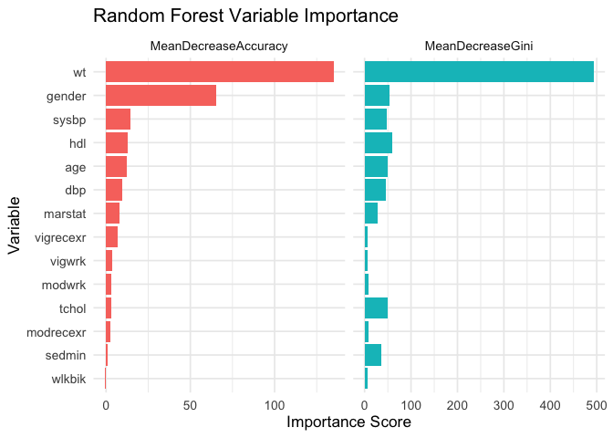
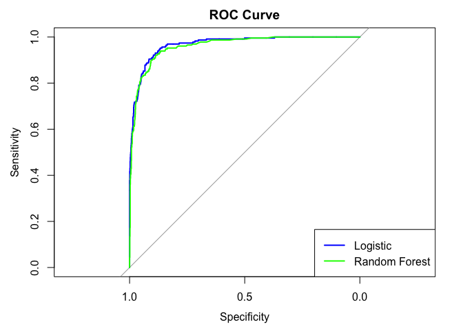

Predicting Obesity from Health and Lifestyle Data
================

## Project Overview

This project builds predictive models to estimate whether a person is
obese based on their health, demographic, and lifestyle characteristics.
The analysis uses the NHANES dataset and compares two modeling
approaches:

- **Logistic regression** for interpretability
- **Random forest** for predictive performance and variable importance

------------------------------------------------------------------------

## Research Question

**Can we predict whether an individual is obese using a combination of
health, demographic, and lifestyle data?**

------------------------------------------------------------------------

### Variables Used

1.  **Target**: `obese` — Obesity defined as BMI \> 35

2.  **Predictors**:

    - Demographics: `age`, `gender`, `marstat`
    - Clinical: `wt`, `ht`, `bmi`, `sysbp`, `dbp`, `hdl`, `tchol`
    - Lifestyle: `sedmin`, `vigwrk`, `modwrk`, `wlkbik`, `vigrecexr`,
      `modrecexr`

------------------------------------------------------------------------

## Data Preparation

``` r
# Keep only complete cases for all needed variables
df <- nhanes %>%
  drop_na() %>%
  select(-id, -psu, -strata, -samplewt, -bmi, -ht)
```

------------------------------------------------------------------------

## Train/Test Split

``` r
set.seed(123)
split <- createDataPartition(df$obese, p = 0.7, list = FALSE)
train <- df[split, ]
test <- df[-split, ]
```

------------------------------------------------------------------------

## Logistic Regression

``` r
# Fit logistic regression
log_model <- glm(obese ~ ., data = train, family = binomial())

# View summary
summary(log_model)
```

    ## 
    ## Call:
    ## glm(formula = obese ~ ., family = binomial(), data = train)
    ## 
    ## Coefficients:
    ##                          Estimate Std. Error z value Pr(>|z|)    
    ## (Intercept)            -2.531e+01  1.484e+00 -17.054  < 2e-16 ***
    ## genderFemale            4.121e+00  2.577e-01  15.989  < 2e-16 ***
    ## age                     1.255e-02  6.888e-03   1.822  0.06849 .  
    ## marstatWidowed          3.436e-01  3.136e-01   1.096  0.27329    
    ## marstatDivorced        -4.183e-01  2.699e-01  -1.550  0.12121    
    ## marstatSeparated        7.029e-01  4.985e-01   1.410  0.15851    
    ## marstatNever Married   -1.700e-01  2.632e-01  -0.646  0.51829    
    ## marstatLiving Together  4.222e-01  3.405e-01   1.240  0.21504    
    ## tchol                   4.382e-03  2.194e-03   1.997  0.04579 *  
    ## hdl                    -7.223e-03  6.235e-03  -1.158  0.24668    
    ## sysbp                   7.560e-03  5.963e-03   1.268  0.20488    
    ## dbp                    -1.621e-02  8.298e-03  -1.954  0.05073 .  
    ## wt                      2.177e-01  1.032e-02  21.088  < 2e-16 ***
    ## vigwrkNo               -1.121e-01  2.460e-01  -0.456  0.64861    
    ## modwrkNo                4.426e-01  1.973e-01   2.243  0.02491 *  
    ## wlkbikNo               -3.703e-02  2.093e-01  -0.177  0.85957    
    ## vigrecexrNo             1.019e-02  2.697e-01   0.038  0.96987    
    ## modrecexrNo             4.802e-01  1.857e-01   2.586  0.00971 ** 
    ## sedmin                 -8.932e-04  4.760e-04  -1.876  0.06062 .  
    ## ---
    ## Signif. codes:  0 '***' 0.001 '**' 0.01 '*' 0.05 '.' 0.1 ' ' 1
    ## 
    ## (Dispersion parameter for binomial family taken to be 1)
    ## 
    ##     Null deviance: 2983.81  on 3440  degrees of freedom
    ## Residual deviance:  959.12  on 3422  degrees of freedom
    ## AIC: 997.12
    ## 
    ## Number of Fisher Scoring iterations: 8

``` r
# Odds ratios with confidence intervals
tidy(log_model, exponentiate = TRUE, conf.int = TRUE)
```

    ## # A tibble: 19 × 7
    ##    term                 estimate std.error statistic  p.value conf.low conf.high
    ##    <chr>                   <dbl>     <dbl>     <dbl>    <dbl>    <dbl>     <dbl>
    ##  1 (Intercept)          1.02e-11  1.48      -17.1    3.28e-65 4.99e-13  1.69e-10
    ##  2 genderFemale         6.16e+ 1  0.258      16.0    1.52e-57 3.78e+ 1  1.04e+ 2
    ##  3 age                  1.01e+ 0  0.00689     1.82   6.85e- 2 9.99e- 1  1.03e+ 0
    ##  4 marstatWidowed       1.41e+ 0  0.314       1.10   2.73e- 1 7.58e- 1  2.60e+ 0
    ##  5 marstatDivorced      6.58e- 1  0.270      -1.55   1.21e- 1 3.84e- 1  1.11e+ 0
    ##  6 marstatSeparated     2.02e+ 0  0.499       1.41   1.59e- 1 7.40e- 1  5.22e+ 0
    ##  7 marstatNever Married 8.44e- 1  0.263      -0.646  5.18e- 1 5.01e- 1  1.41e+ 0
    ##  8 marstatLiving Toget… 1.53e+ 0  0.341       1.24   2.15e- 1 7.76e- 1  2.95e+ 0
    ##  9 tchol                1.00e+ 0  0.00219     2.00   4.58e- 2 1.00e+ 0  1.01e+ 0
    ## 10 hdl                  9.93e- 1  0.00624    -1.16   2.47e- 1 9.81e- 1  1.00e+ 0
    ## 11 sysbp                1.01e+ 0  0.00596     1.27   2.05e- 1 9.96e- 1  1.02e+ 0
    ## 12 dbp                  9.84e- 1  0.00830    -1.95   5.07e- 2 9.68e- 1  1.00e+ 0
    ## 13 wt                   1.24e+ 0  0.0103     21.1    1.02e-98 1.22e+ 0  1.27e+ 0
    ## 14 vigwrkNo             8.94e- 1  0.246      -0.456  6.49e- 1 5.53e- 1  1.45e+ 0
    ## 15 modwrkNo             1.56e+ 0  0.197       2.24   2.49e- 2 1.06e+ 0  2.30e+ 0
    ## 16 wlkbikNo             9.64e- 1  0.209      -0.177  8.60e- 1 6.41e- 1  1.46e+ 0
    ## 17 vigrecexrNo          1.01e+ 0  0.270       0.0378 9.70e- 1 5.98e- 1  1.73e+ 0
    ## 18 modrecexrNo          1.62e+ 0  0.186       2.59   9.71e- 3 1.13e+ 0  2.33e+ 0
    ## 19 sedmin               9.99e- 1  0.000476   -1.88   6.06e- 2 9.98e- 1  1.00e+ 0

------------------------------------------------------------------------

## Random Forest

``` r
rf_model <- randomForest(obese ~ ., data = train, importance = TRUE, ntree = 500)

# Plot importance

# Extract importance and reshape
imp_df <- importance(rf_model) %>%
  as.data.frame() %>%
  rownames_to_column("Variable") %>%
  pivot_longer(cols = c(MeanDecreaseAccuracy, MeanDecreaseGini),
               names_to = "Metric",
               values_to = "Importance")

# Reorder variables by importance per metric
imp_df <- imp_df %>%
  group_by(Metric) %>%
  mutate(Variable = reorder(Variable, Importance))

# Plot side-by-side (faceted)
ggplot(imp_df, aes(x = Variable, y = Importance, fill = Metric)) +
  geom_col(show.legend = FALSE) +
  coord_flip() +
  facet_wrap(~ Metric, scales = "free_x") +
  labs(title = "Random Forest Variable Importance",
       x = "Variable",
       y = "Importance Score") +
  theme_minimal(base_size = 13)
```

<!-- -->

#### Interpretation Summary (variable importance)

| Variable | Interpretation |
|----|----|
| `wt` | Strongest predictor — heavier individuals more likely to be obese (unsurprisingly). |
| `gender` | Likely captures biological or behavioral differences in obesity risk. |
| `hdl`, `tchol`, `sysbp` | Cardiovascular risk markers tied to obesity. |
| `age` | Obesity patterns shift with age. |
| Activity variables | Weak predictors relative to clinical/demographic variables. They may add value but don’t drive the model. |

------------------------------------------------------------------------

## Model Evaluation

``` r
# Logistic predictions
log_pred_prob <- predict(log_model, newdata = test, type = "response")
log_pred_class <- ifelse(log_pred_prob > 0.5, "Yes", "No") %>% factor(levels = c("No", "Yes"))

# Random forest predictions
rf_pred_class <- predict(rf_model, newdata = test)
rf_pred_prob <- predict(rf_model, newdata = test, type = "prob")[, 2]

# Confusion matrices
confusionMatrix(log_pred_class, test$obese)
```

    ## Confusion Matrix and Statistics
    ## 
    ##           Reference
    ## Prediction   No  Yes
    ##        No  1199   59
    ##        Yes   45  171
    ##                                          
    ##                Accuracy : 0.9294         
    ##                  95% CI : (0.9152, 0.942)
    ##     No Information Rate : 0.844          
    ##     P-Value [Acc > NIR] : <2e-16         
    ##                                          
    ##                   Kappa : 0.7253         
    ##                                          
    ##  Mcnemar's Test P-Value : 0.2024         
    ##                                          
    ##             Sensitivity : 0.9638         
    ##             Specificity : 0.7435         
    ##          Pos Pred Value : 0.9531         
    ##          Neg Pred Value : 0.7917         
    ##              Prevalence : 0.8440         
    ##          Detection Rate : 0.8134         
    ##    Detection Prevalence : 0.8535         
    ##       Balanced Accuracy : 0.8537         
    ##                                          
    ##        'Positive' Class : No             
    ## 

``` r
confusionMatrix(rf_pred_class, test$obese)
```

    ## Confusion Matrix and Statistics
    ## 
    ##           Reference
    ## Prediction   No  Yes
    ##        No  1212   67
    ##        Yes   32  163
    ##                                           
    ##                Accuracy : 0.9328          
    ##                  95% CI : (0.9188, 0.9451)
    ##     No Information Rate : 0.844           
    ##     P-Value [Acc > NIR] : < 2.2e-16       
    ##                                           
    ##                   Kappa : 0.7281          
    ##                                           
    ##  Mcnemar's Test P-Value : 0.0006329       
    ##                                           
    ##             Sensitivity : 0.9743          
    ##             Specificity : 0.7087          
    ##          Pos Pred Value : 0.9476          
    ##          Neg Pred Value : 0.8359          
    ##              Prevalence : 0.8440          
    ##          Detection Rate : 0.8223          
    ##    Detection Prevalence : 0.8677          
    ##       Balanced Accuracy : 0.8415          
    ##                                           
    ##        'Positive' Class : No              
    ## 

#### Overall Comparison

| Metric            | Log Prediction  | RF Prediction    | Better         |
|-------------------|-----------------|------------------|----------------|
| Accuracy          | 92.94%          | **93.28%**       | RF Prediction  |
| Sensitivity (No)  | 96.38%          | **97.43%**       | RF Prediction  |
| Specificity (Yes) | **74.35%**      | 70.87%           | Log Prediction |
| Balanced Accuracy | **85.37%**      | 84.15%           | Log Prediction |
| Kappa             | 0.7253          | **0.7281**       | RF Prediction  |
| Mcnemar’s p-value | **0.2024** (NS) | 0.00063 (signif) | Log Prediction |

------------------------------------------------------------------------

## ROC Curves and AUC

``` r
# ROC for logistic
log_roc <- roc(test$obese, log_pred_prob)
```

    ## Setting levels: control = No, case = Yes

    ## Setting direction: controls < cases

``` r
plot(log_roc, col = "blue", main = "ROC Curve")
auc(log_roc)
```

    ## Area under the curve: 0.9682

``` r
# Add random forest ROC
rf_roc <- roc(test$obese, rf_pred_prob)
```

    ## Setting levels: control = No, case = Yes
    ## Setting direction: controls < cases

``` r
lines(rf_roc, col = "green")
legend("bottomright", legend = c("Logistic", "Random Forest"),
       col = c("blue", "green"), lwd = 2)
```

<!-- -->

``` r
auc(rf_roc)
```

    ## Area under the curve: 0.9613

#### ROC Curve Interpretation Summary

1.  **Model Performance Comparison**
    - Both models (Logistic Regression and Random Forest) perform well.
    - Their ROC curves closely overlap, indicating **similar
      classification performance**.
2.  **Sensitivity vs. Specificity Trade-off**
    - Both models achieve **high sensitivity** (true positive rate) with
      **low false positives**.
    - This means they effectively identify obese individuals **without
      heavily misclassifying non-obese individuals**.
3.  **Random Baseline Reference**
    - The diagonal gray line represents a **random guess** (AUC = 0.5).
    - Both curves stay well above it, confirming that the models
      **perform significantly better than random guessing**.

------------------------------------------------------------------------

## Summary

| Model         | Strengths                  | Weaknesses                        |
|---------------|----------------------------|-----------------------------------|
| Logistic      | Interpretable coefficients | May miss non-linear relationships |
| Random Forest | High predictive power      | Harder to interpret               |

- **Logistic regression** gives interpretable odds ratios. For example,
  higher sedentary minutes may significantly increase the odds of
  obesity.
- **Random forest** captures more complex relationships and interaction
  effects. Use the variable importance plot to identify key predictors.
- **AUC and confusion matrices** help assess which model performs better
  on unseen data.

Both models contribute to understanding and predicting obesity. The
approach balances **explanation** and **prediction** to help guide
interventions and deeper research.
